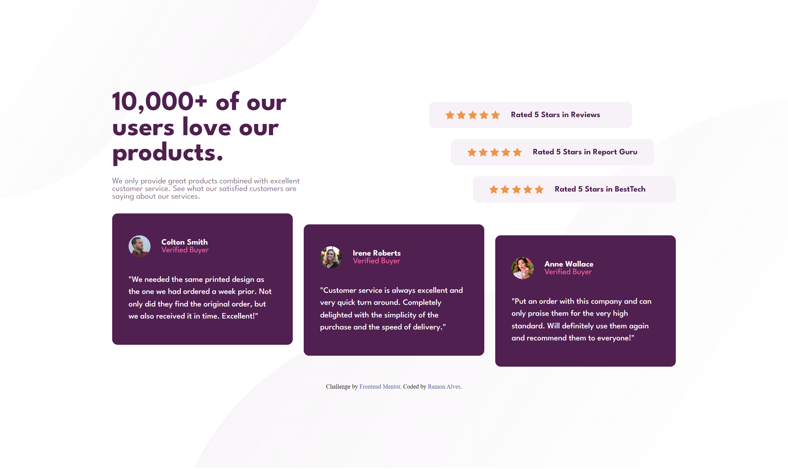
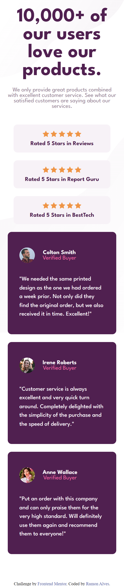

# Frontend Mentor - Social proof section solution

This is a solution to the [Social proof section challenge on Frontend Mentor](https://www.frontendmentor.io/challenges/social-proof-section-6e0qTv_bA). Frontend Mentor challenges help you improve your coding skills by building realistic projects. 

## Overview

### The challenge 🏆

Users should be able to:

- View the optimal layout for the section depending on their device's screen size

## Screenshot 🎴

- ### Desktop Preview


- ### Mobile Preview


- ### Responsivity


### Links 💻

- Solution URL: [Add solution URL here](https://your-solution-url.com)
- Live Site URL: [Add live site URL here](https://your-live-site-url.com)

## My process ✒

### Built with 🧱🛠

- Semantic HTML5 markup
- CSS custom properties
- Flexbox
- CSS Grid


### What I learned 📚

In this project I had the chance to use several new things, from the Grid to the use of rem (and also position relative and background patterns positioning). I am very grateful for the pasts feedbacks and I look forward to future contribuitions too 😁.

Here are some code snippets that I was proud of:


- Optimized background pattern styling

```css
/* Background Patterns Position */
.pattern-top,
.pattern-bottom {
    position: absolute;
}
.pattern-top {
    top: 0;
    left: 0;

    z-index: -1;
}
.pattern-bottom {
    bottom: 0rem;
    right: 0;

    z-index: -2;
}
```


- Grid configuration
```css
.container {
    max-width: 110rem;
    display: grid;
    grid-template-areas: 
        "header ratings"
        "feedback feedback";
    grid-template-columns: 35rem 1fr;
    grid-template-rows: fit-content fit-content;
    padding: 2rem;

    font-family: "League Spartan", sans-serif;
    font-size: 1.5rem;
}
```


- Configuration and positioning of elements with Position relative

```css
.rating-card:first-child {
    right: 8rem;
}

.rating-card:nth-child(2) {
    right: 4rem;
}

...

.card {
    background-color: var(--CardAndTittle);
    max-width: 33rem;
    padding: 4rem 3rem;
    border-radius: 1rem;
    position: relative;

    color: var(--RatingCard);
}
.card:nth-child(2) {
    top: 2rem;
}
.card:last-child {
    top: 4rem;
}
```


### Continued development 🚀

My current goal is to finish all the FrontEnd Mentor challenges, to train and learn in the process. After finishing all HTML and CSS challenges, I will start JavaScript lessons.

### Useful resources

- Dev em Dobro - Grid lessons

## Author 🧙‍♂️

- GitHub - [Ramon Alvez](https://github.com/Ramon-Alvez)
- Frontend Mentor - [@Ramon Alvez](https://www.frontendmentor.io/profile/Ramon-Alvez)
- LinkedIn - [@Ramon Alvez](https://www.linkedin.com/in/ramon-alvez/)


## Acknowledgments 👑

Thanks to Dev em Dobro for the Grid class.
